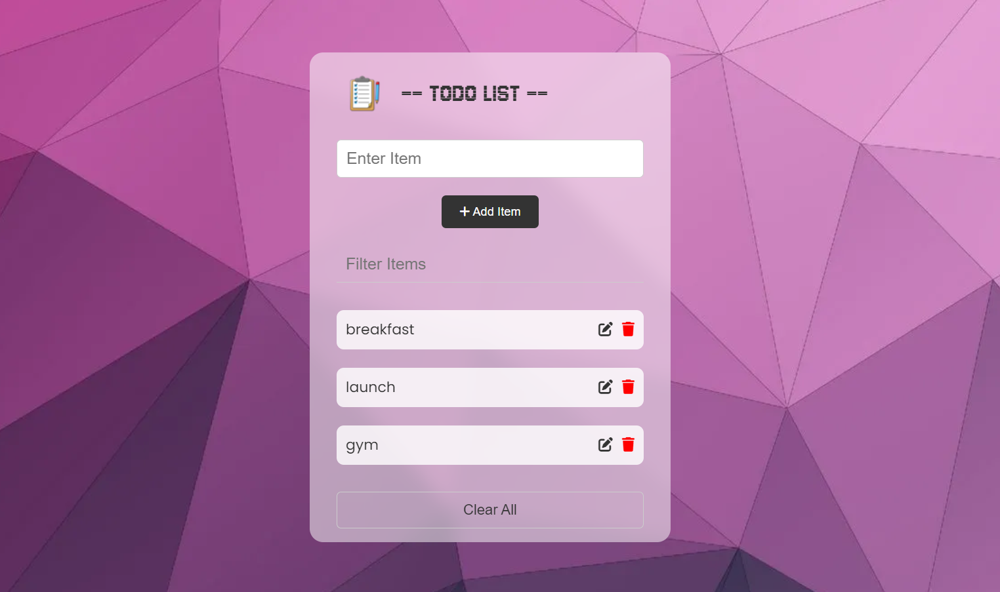

# Todo List

A simple, interactive todo list application built with HTML, CSS, and JavaScript. Features include adding, editing, filtering, and removing tasks, with data persistence through local storage. Tasks can be marked as completed by clicking on the item, and the app provides a clean, user-friendly interface.

## project is deployed on netlify
[Live](https://singular-clafoutis-cdf68c.netlify.app/)

